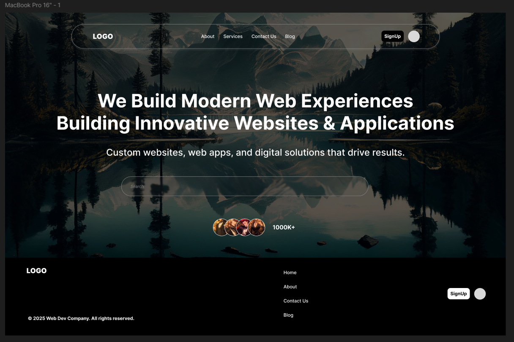
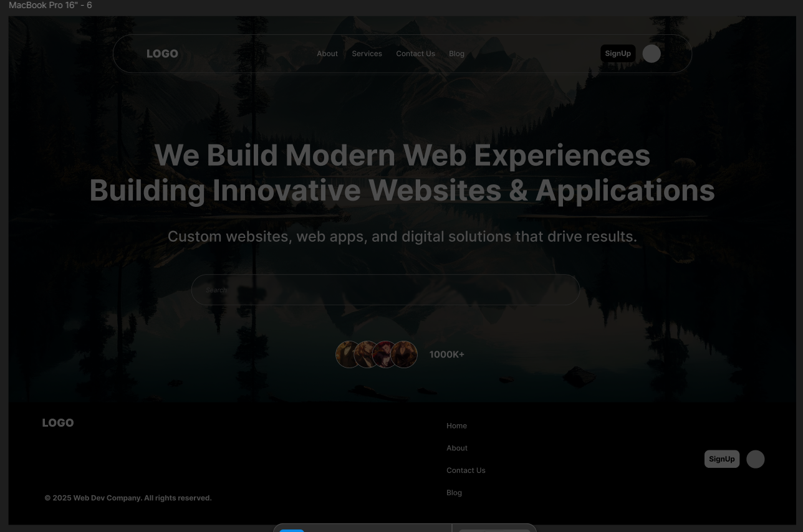
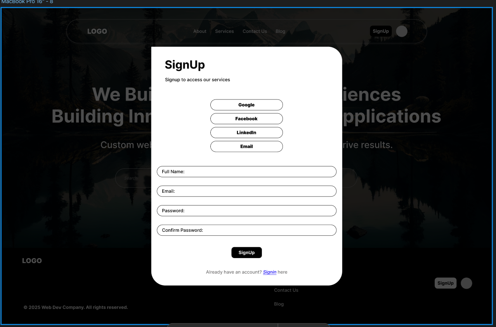
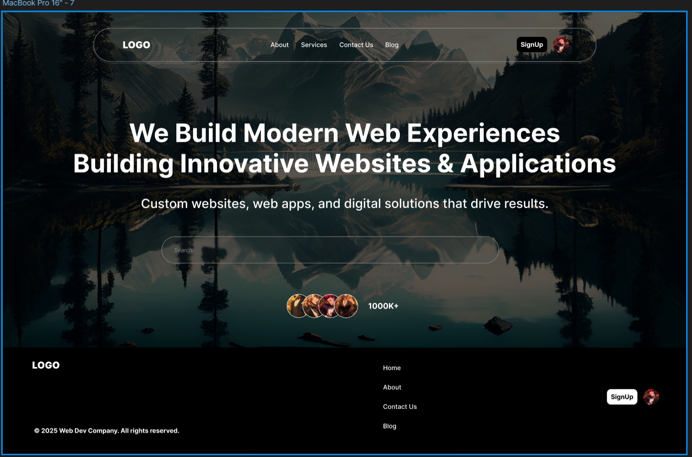
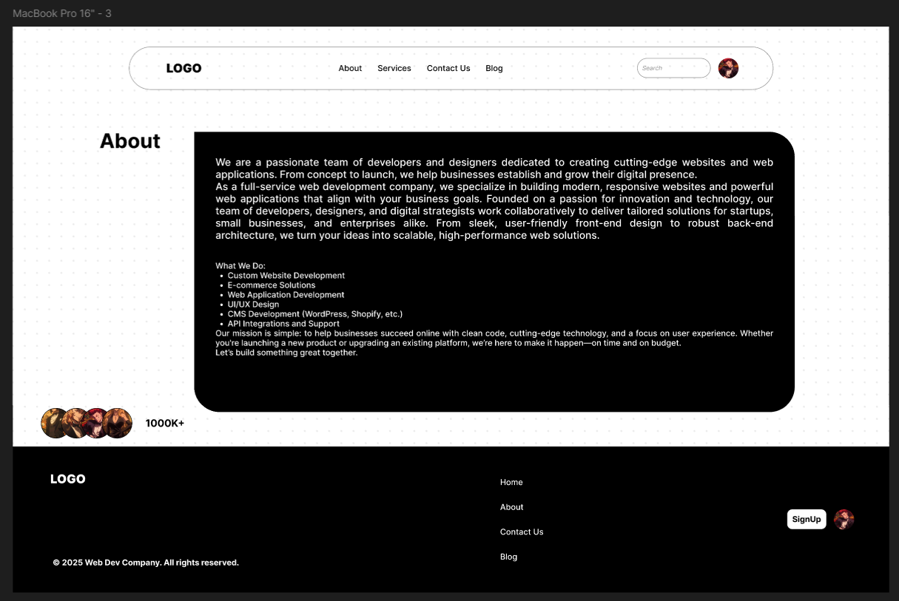
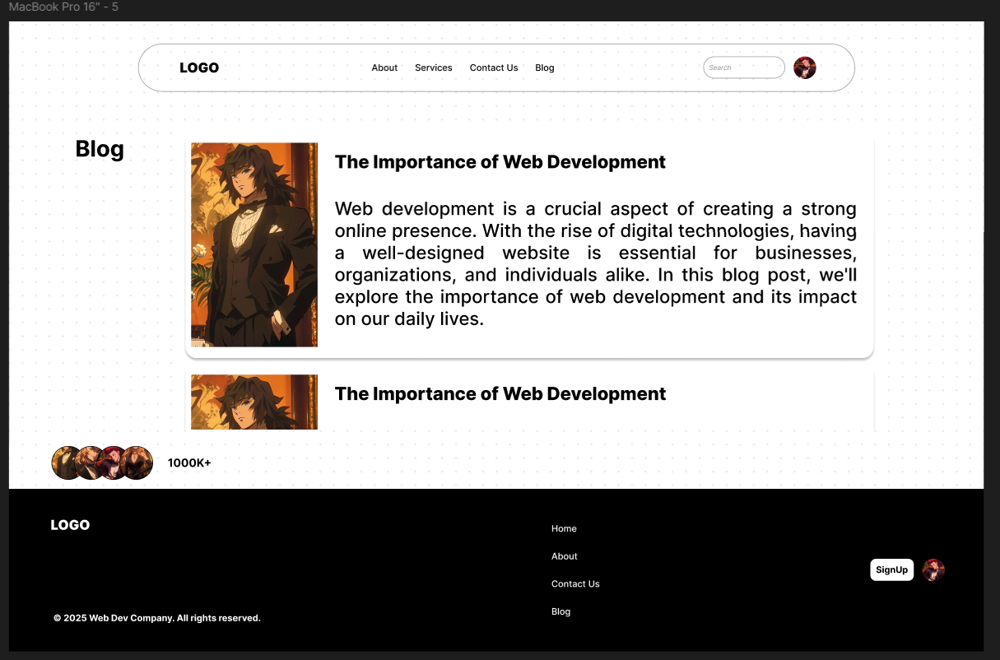
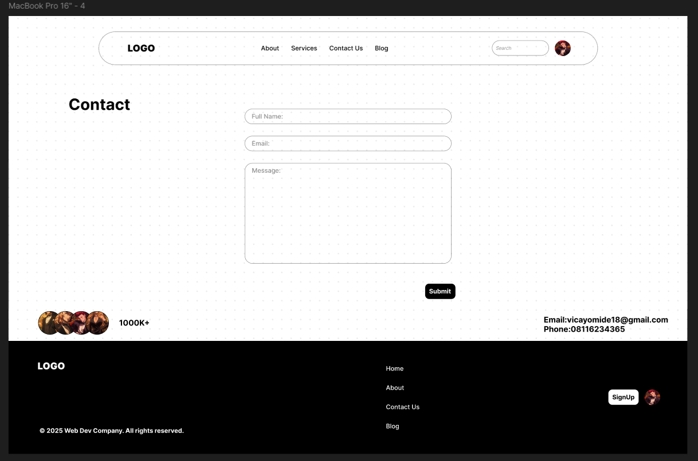
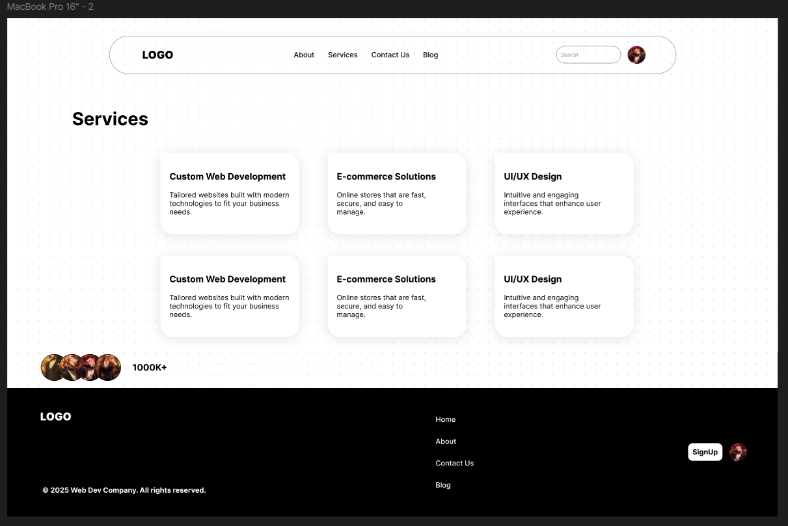

# 🌐 Modern Web Design Lab

> _"Crafting interfaces that speak design, breathe usability, and evolve toward full-stack excellence."_

---

## 🚀 Project Overview

**Modern Web Design Lab** is a hands-on web design project I developed during my **Industrial Training (IT)** as part of my Computer Science degree at the **University of Port Harcourt**.

This project reflects my passion for **front-end engineering** — focusing on clean layouts, responsive structure, semantic HTML, and modern CSS styling principles.  
It also serves as a stepping stone in my continuous journey toward becoming a **Full-Stack Software Development Engineer**.

---

## 🎯 Core Objectives

- 🧩 Demonstrate strong understanding of **HTML5 semantics**
- 🎨 Apply **modern CSS3 techniques** (Flexbox, Grid, Animations, Media Queries)
- 📱 Build a **responsive and accessible** web layout
- ⚙️ Showcase industry-standard **front-end project structure**
- 💡 Express a mindset of continuous learning and design thinking

---

## 🛠️ Tech Stack

| Technology       | Purpose                                   |
| ---------------- | ----------------------------------------- |
| **HTML5**        | Structure and semantics                   |
| **CSS3**         | Styling and responsiveness                |
| **JavaScript**   | Interactive behavior                      |
| **Git & GitHub** | Version control and project collaboration |
| **VS Code**      | Development environment                   |

---

## 🧩 Features

- ✅ Clean and structured HTML5 architecture
- ✅ Responsive design using **CSS Grid** and **Flexbox**
- ✅ Consistent color palette and typography
- ✅ Mobile-first layout
- ✅ Optimized for readability and reusability

---

## � Folder Structure

```
modern-web-design-lab/
├── about.html
├── blog.html
├── contact.html
├── index.html
├── service.html
├── README.md
├── assets/
│   ├── images/
│   │   ├── background.jpg
│   │   ├── boy-543x960.jpg
│   │   └── dotter-background.jpg
│   └── project-screenshot/
│       ├── about.png
│       ├── blog.png
│       ├── contact-us.png
│       ├── fade-index.png
│       ├── index.png
│       ├── service.png
│       ├── signedIn-index.png
│       └── signUp.png
├── css/
│   ├── about-style.css
│   ├── blog-style.css
│   ├── contact.css
│   ├── main.css
│   ├── service.css
│   └── style.css
└── js/
	└── script.js
```

---

## 📸 Project Preview

> _(Preview or screenshot GIF of the project design here)_

<!-- markdownlint-disable MD033 -->








<!-- markdownlint-enable MD033 -->

---

## 💡 What I Learned

During the development of this project, I learned:

- How to apply **responsive design principles** to real-world layouts.
- The importance of **semantic HTML** in accessibility and SEO.
- How to use **CSS Grid and Flexbox** to create adaptive page structures.
- The power of **clean, maintainable code** for scalability and collaboration.

---

## 🌱 Future Improvements

- Add **JavaScript interactivity** (form validation, animations, etc.)
- Integrate **API-based dynamic content**
- Convert to a **React-based SPA (Single Page Application)**
- Implement **dark/light theme toggle**

---

## 🤝 Collaboration

I’m always open to learning and collaborating on front-end, back-end and full-stack projects.  
If you’re passionate about building beautiful, functional web applications — let’s connect!

📧 **Email:** collinsprogress@gmail.com  
📱 **X:** [](#)
💼 **LinkedIn:** [linkedin.com/in/your-profile](#)  
🐙 **GitHub:** [github.com/yourusername](#)

---

## 🧭 About Me

👋 Hi there!  
I’m a **Computer Science student at the University of Port Harcourt** and an **aspiring Full-Stack Software Development Engineer**.  
With every line of code, I strive to blend **creativity**, **logic**, and **modern technology** — building digital experiences that make an impact.

---

## 🏁 Closing Note

> _"Great engineers aren’t born — they’re built through curiosity, code, and continuous growth."_

If this project resonates with you, don’t forget to ⭐ **Star this repo** and share your feedback!

---
